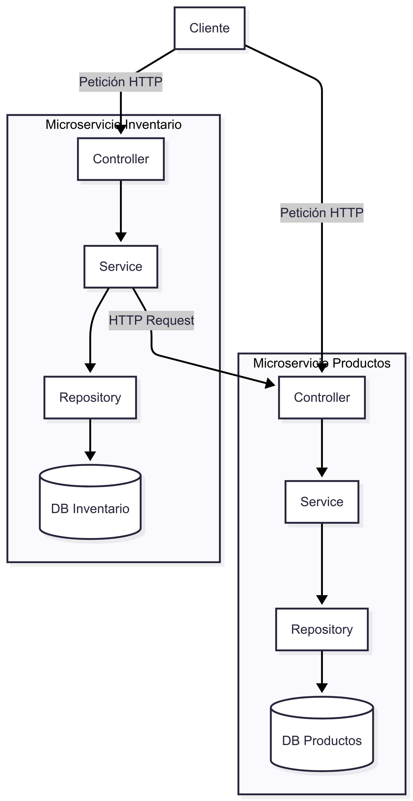

Sistema de Gestión de Productos e Inventario

Esta prueba técnica implementa un sistema de gestión de productos e inventario basado en una arquitectura de microservicios, con una interfaz de usuario moderna construida en React. Todo el sistema está contenedorizado con Docker y orquestado con Docker Compose para un despliegue y desarrollo simplificado.

Arquitectura
El sistema se compone de los siguientes servicios:

ms-productos: Microservicio en Java (Spring Boot) que gestiona el ciclo de vida de los productos (CRUD). Requiere una API Key para su acceso.

ms-inventario: Microservicio en Java (Spring Boot) que gestiona el stock de los productos. Se comunica internamente con ms-productos para obtener detalles.

frontend-ui: Interfaz de usuario en React que consume los endpoints de ambos microservicios para proporcionar una experiencia de gestión visual.

db: Base de datos PostgreSQL utilizada por ambos microservicios.

Comunicación entre Servicios
Protocolo: La comunicación entre el frontend y los microservicios, así como entre los propios microservicios, se realiza mediante peticiones HTTP RESTful.

Formato de Datos: Se utiliza el estándar JSON para el intercambio de datos.

Autenticación: El microservicio ms-productos está protegido y requiere una API Key en la cabecera X-API-KEY para todas las peticiones.

Resiliencia: Se contempla la implementación de patrones como reintentos y timeouts para la comunicación entre ms-inventario y ms-productos para mejorar la robustez del sistema.

Funcionalidades Detalladas
Microservicio 1: Productos (ms-productos)
Gestiona toda la información relativa a los productos.

POST /api/v1/products: Crea un nuevo producto.

GET /api/v1/products/{id}: Obtiene un producto específico por su ID.

PUT /api/v1/products/{id}: Actualiza un producto existente por su ID.

DELETE /api/v1/products/{id}: Elimina un producto por su ID.

GET /api/v1/products: Lista todos los productos con soporte para paginación (ej. ?page=0&size=10).

Microservicio 2: Inventario (ms-inventario)
Gestiona el stock y se comunica con el servicio de productos.

GET /api/v1/inventory/{productId}: Consulta la cantidad disponible de un producto, enriqueciendo la respuesta con los detalles (nombre, precio) obtenidos desde ms-productos.

PATCH /api/v1/inventory/{productId}/stock: Actualiza la cantidad de un producto. Acepta cantidades positivas (añadir stock) y negativas (restar stock).

Emisión de Eventos: Tras una actualización de stock, el servicio emite un evento simple (actualmente, un mensaje en la consola del contenedor) para notificar el cambio.

Requisitos Previos
Asegurarse de tener instalado el siguiente software en su pc:

Docker

Docker Compose

Java 17 o superior

Apache Maven 3.3.1 o superior

Node.js 18 o superior - para la vista de react

Estructura del Proyecto
/
├── msProductos/         # Microservicio de Productos (Spring Boot)
├── msInventario/        # Microservicio de Inventario (Spring Boot)
├── front-inventario/    # Interfaz de Usuario (React)
└── docker-compose.yml   # Archivo de orquestación de Docker
└── README.md    
        

Instalación y Ejecución:
Seguir estos pasos para levantar el sistema completo.

1. Construir los Microservicios de Backend
Antes de levantar los contenedores, es necesario compilar los proyectos de Java y crear los archivos .jar ejecutables.

Abrir una terminal en la raíz del proyecto y ejecutar los siguientes comandos en orden:

# Navegar al directorio del microservicio de productos y construirlo
cd msProductos
mvn clean install

# Volver a la raíz y hacer lo mismo para el microservicio de inventario
cd ../msInventario
mvn clean install

# Volver a la raíz del proyecto
cd ..

2. Levantar Todo el Sistema con Docker Compose
Una vez que los archivos .jar han sido creados, se puede levantar toda la infraestructura con un solo comando desde la raíz del proyecto:

docker-compose up --build

El flag --build le indica a Docker que construya las imágenes de los microservicios y la vista.

La primera vez que se ejecute, Docker descargará las imágenes base (PostgreSQL, Nginx, Node), lo que puede tardar unos minutos.

Después de que todos los contenedores se inicien, el sistema estará listo.

Uso y Documentación
Interfaz de Usuario (Frontend)
Accede a la aplicación web abriendo tu navegador en:
http://localhost:93

Documentación de la API (Swagger)
Cada microservicio expone su propia documentación de API interactiva a través de Swagger UI.

Documentación de ms-productos:
http://localhost:8091/swagger-ui.html

Documentación de ms-inventario:
http://localhost:8092/swagger-ui.html

APIs (Backend)
Puedes interactuar directamente con las APIs usando herramientas como Postman.

Microservicio de Productos: http://localhost:8091/api/v1/products

Importante: Todas las peticiones deben incluir la cabecera X-API-KEY: mi-api-key-secreta.

Microservicio de Inventario: http://localhost:8092/api/v1/inventory

Este servicio no requiere autenticación.

Pruebas (Testing)
El proyecto incluye una estrategia de pruebas para garantizar la calidad y robustez del código.

Pruebas Unitarias: Se enfocan en componentes individuales (servicios, controladores) en aislamiento. Cubren la lógica de negocio, como la creación y actualización de productos.

Pruebas de Integración: Se incluye al menos una prueba de integración por microservicio (*IntegrationTest.java) que levanta un contexto de Spring y, en el caso de msInventario, utiliza WireMock para simular la comunicación con ms-productos. Para la base de datos, se utiliza Testcontainers para levantar una instancia real de PostgreSQL, asegurando que las pruebas se ejecuten en un entorno lo más parecido posible al de producción.

Para ejecutar las pruebas durante el proceso de construcción de Maven, simplemente ejecutar:

mvn clean install

Tecnologías Utilizadas
Backend: Java 17, Spring Boot 3, Spring Security, Spring Data JPA, Lombok, Maven

Frontend: React, JavaScript (ES6+), CSS

Base de Datos: PostgreSQL

Pruebas: JUnit 5, Mockito, Testcontainers, WireMock

Contenedorización: Docker, Docker Compose

Servidor Web (Frontend): Nginx